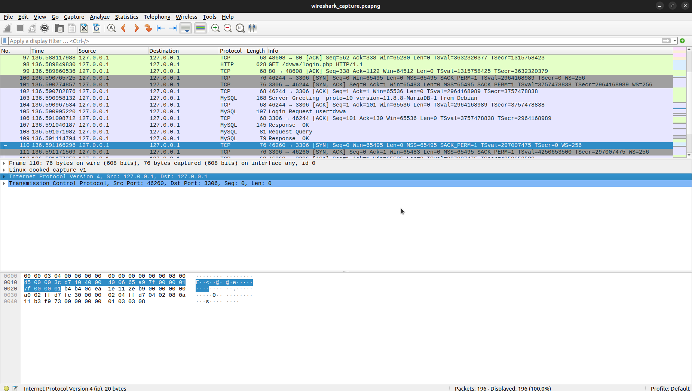
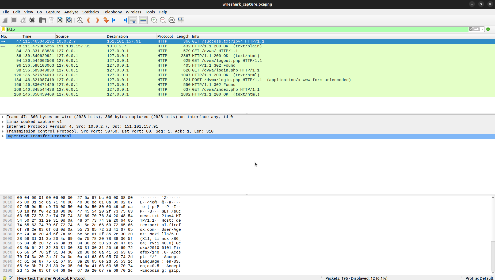
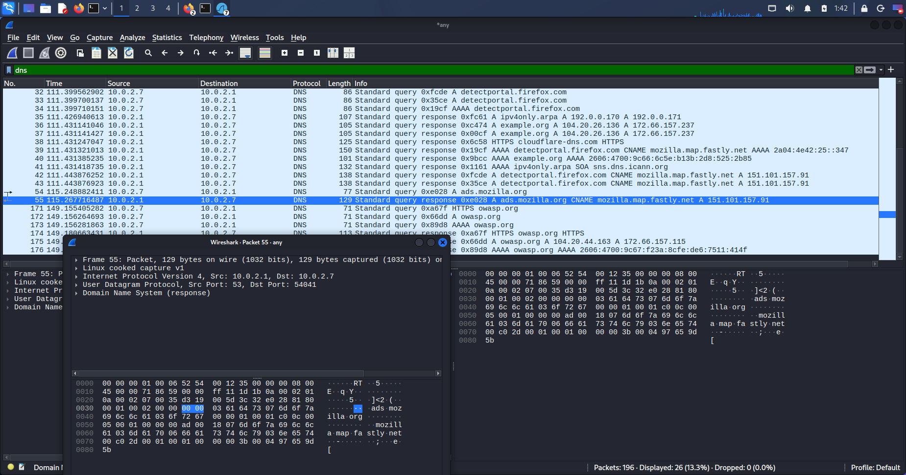
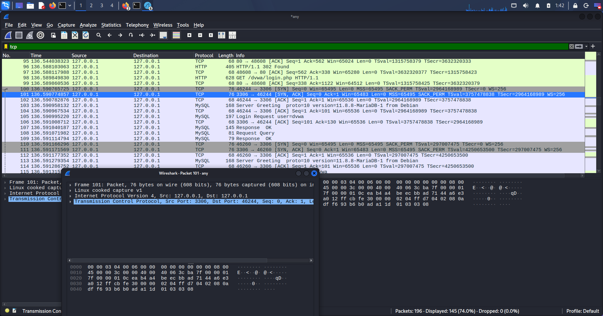
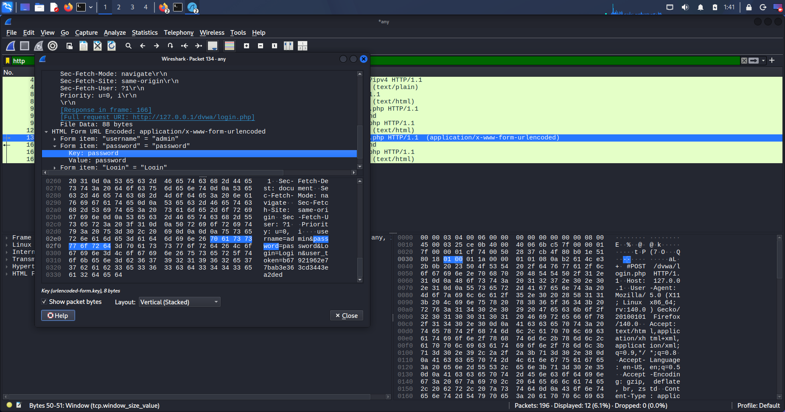

# Task 8 — Capture Network Traffic with Wireshark

## Objective
Capture live network traffic using Wireshark, apply display filters to isolate specific
protocols, analyse packet contents, and document findings with security observations.

## Glossary
- **Packet** — [Write in your own words: a formatted unit of data sent over a network,
  made up of header information (addressing/control data) and a payload.]
- **Protocol** — [your words — an agreed set of rules two systems follow to communicate]
- **Port** — [your words — a number that identifies which application on a host a
  packet is intended for]
- **Payload** — [your words — the actual content being carried, as opposed to the
  header metadata wrapped around it]
- **Handshake** — [your words — a negotiation sequence performed before real data is
  exchanged, so both sides agree on connection parameters]

## Tools Used
- Wireshark [version — run `wireshark --version`]
- [Your OS / interface, e.g., Wi-Fi adapter on Windows 11]

## Installation
[Describe exactly how you installed it and what permissions were needed —
e.g., "Installed via the official Wireshark installer on Windows, which bundled Npcap.
Ran Wireshark as Administrator to capture live traffic." OR
"Installed with `sudo apt install wireshark` on Kali Linux; added my user to the
`wireshark` group during setup to avoid running as root for every capture."]

## Capture Process
1. Opened Wireshark and selected the [interface name] interface, which showed live
   traffic activity.
2. Started the capture and generated traffic for [X] minutes by browsing several
   websites (including one plain-HTTP site to guarantee unencrypted examples).
3. Stopped the capture and exported it as `wireshark_capture.pcap`.

## Filter 1 — HTTP Traffic (`http`)
[Describe what you found — how many HTTP packets, which site, what a GET request
looked like.]

## Filter 2 — DNS Traffic (`dns`)
[Describe the query/response pairs you observed — which domains were resolved.]

## Filter 3 — TCP Traffic & 3-Way Handshake (`tcp`)
[Explain in your own words what SYN, SYN-ACK, and ACK each represent, and point to the
specific packet numbers in your capture.]

**Handshake sequence identified:**
1. Packet #[N] — `[SYN]` — client proposes initial sequence number
2. Packet #[N] — `[SYN, ACK]` — server acknowledges and proposes its own sequence number
3. Packet #[N] — `[ACK]` — client acknowledges; connection established

## Unencrypted Data Finding
[Identify the specific HTTP packet you inspected and exactly what information was
visible in plaintext — e.g., Host header, request path, cookies, User-Agent.]

## Why Unencrypted HTTP Traffic Is Dangerous
[Explain in your own words: HTTP sends data as plaintext, so anyone positioned on the
network path — same Wi-Fi, a compromised router, an ISP — can read it directly with a
tool like Wireshark, no decryption required. Explain how HTTPS (via TLS) fixes this by
encrypting the payload after a cryptographic handshake, so an eavesdropper only sees
ciphertext and connection metadata, not the actual content.]

## Ethics Note
All traffic was captured on my own machine / network that I own and administer. No
public Wi-Fi, university, or third-party networks were used. Unauthorized packet
capture on networks without explicit permission may violate wiretapping and
computer-misuse laws in many jurisdictions.

